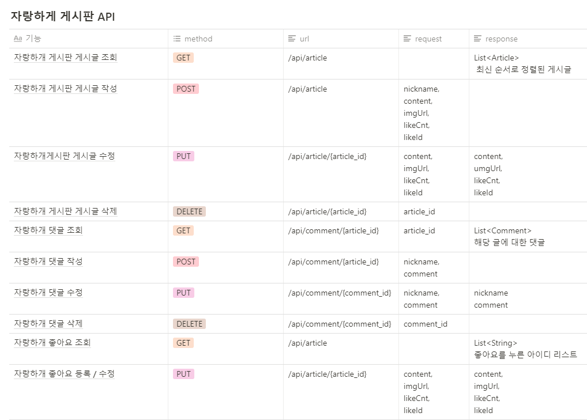
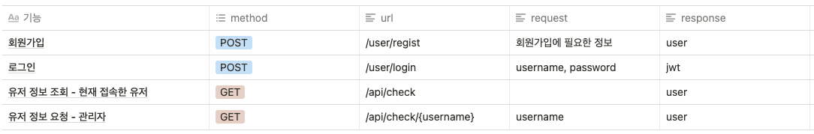

# find_dog

http://finddog.mini.s3-website.ap-northeast-2.amazonaws.com/


[영상으로 보러가기](https://www.youtube.com/watch?v=zX-L3am3so4)

```
개발 인원: 백앤드 3명 (강미진, 김동현, 임다희) / 프론트 2명 (김형민, 심현인)
```
# 목차

- [1. 주제](#주제)
- [2. 개발 언어](#개발언어)
- [3. 개발 환경](#개발환경)
- [4. 기능](#기능)
- [5. API 설계](#API설계)
- [6. 기능 상세 소개](#기능상세소개)
- [7. 동작화면](#동작화면)

<br>

## 주제

강아지가 이뻐서 쉽게 분양을 받고 성향이 맞지 않아 쉽게 파양을 하는 사람들이 많이 있습니다
처음부터 분양을 받기 위한 까다로운 조건을 만들면 좋겠지만 개인의 힘으로는 강제하기가 쉽지 않습니다
조금이라도 파양되는 강아지의 수를 줄이고 한번 파양서 새로운 주인을 기다리는 귀여운 강아지를 
좋은 사람에게 소개해 주는 사이트를 만들고자 하였습니다.

<br>

## 개발언어
- Backend: Java 8
- Frontend: React

<br>

## 개발환경
- Java: JDK 1.8
- IDE: IntelliJ
- DB : mySQL
- 빌드 관리 : Gradle
- 프레임워크: SpringBoot
> - ORM: Spring-Data-JPA
> - 보안 : Spring security
> - 형상 관리 툴 : git
> - Others: Websocket, Lombok

<br>

## 기능

1. mbti 검사를 통한 자신과 성향이 맞는 강아지 추천 url: https://github.com/DongHyunKIM-Hi/mbti
2. chat봇을 통한 상담
3. 게시글 및 댓글 CRUD 기능
4. 좋아요 구현
5. 회원가입 / 로그인

<br>

## API설계

### MBTI 및 chat봇 상담


### 자랑하개 게시판


### 회원가입 / 로그인


## 기능상세소개

### 게시글 CRUD 구현

***

#### Article Entity

<pre>
<code>
    @Column
    @ElementCollection
    private List<String> likeId = new ArrayList<>();

    public Article(ArticleRequestDto requestDto){
        this.nickname = requestDto.getNickname();
        this.content = requestDto.getContent();
        this.imgUrl = requestDto.getImgUrl();
        this.likeCnt = requestDto.getLikeCnt();
        this.likeId = requestDto.getLikeId();

    }

    public void update(ArticleRequestDto requestDto){
        this.content = requestDto.getContent();
        this.imgUrl = requestDto.getImgUrl();
        this.likeCnt = requestDto.getLikeCnt();
        this.likeId = requestDto.getLikeId();
    }
</code>
</pre>

+ 자랑하개에 글을 올릴 때 필요한 항목을 전부 멤버변수로 생성하였습니다. 
+ 좋아요 기능을 게시글에 포함하여 생성하였습니다.

<br>

#### Article Repository
<pre>
<code>
    @Transactional
    public List<String> update(Long id, ArticleRequestDto requestDto){
        Article article = articleRepository.findById(id).orElseThrow(
                () ->new NullPointerException("해당 게시글이 존재하지 않습니다.")
        );
        String likeNickname = requestDto.getNickname();
        requestDto.getLikeId().add(likeNickname);
        article.update(requestDto);
        return requestDto.getLikeId();
    }
</code>
</pre>
+ 자랑하개에 있는 게시글을 수정할 때 변경 사항을 수정하여 업데이트하고 좋아요를 누른 유저들의 닉네임 리스트를 반환하여 줍니다.
+ Spring Data JPA를 사용하기 위해 JpaRepository를 상속하고 Article Entity와 연결합니다.

<br>

#### Article Controller
<pre>
<code>
    @ResponseBody
    @GetMapping( "/api/article")
    public List<Article> getArticle(){

        return articleRepository.findAllByOrderByModifiedAt();
    }

    @ResponseBody
    @PostMapping("/api/article")
    public Article creatArticle(@RequestBody ArticleRequestDto requestDto){
        Article article = new Article(requestDto);
        return articleRepository.save(article);
    }

    @PutMapping( "/api/article/{article_id}")
    public  List<String>  updateArticle(@PathVariable Long article_id, @RequestBody ArticleRequestDto requestDto){
        return articleService.update(article_id, requestDto);
    }

    @DeleteMapping( "/api/article/{article_id}")
    public Long deleteArticle(@PathVariable Long article_id) {
        articleRepository.deleteById(article_id);
        return article_id;
    }
</code>
</pre>

+ 업데이트는 business layer에서 로직을 처리하고 get과 delete는 데이터를 repository에서 받아와 처리하는 방법으로 기능을 구현했습니다. 

<br>

### 댓글 CRUD

***

#### Comment Entity
<pre>
<code>
@Getter
@Setter
@Entity
@NoArgsConstructor
public class Comment {

    @GeneratedValue(strategy = GenerationType.AUTO)
    @Id
    private Long id;

    @Column
    private String comment;

    @Column
    private String nickname;

    @ManyToOne
    @JoinColumn(nullable = false)
    private Article article;


    public Comment(CommentRequestDto requestDto, Article article){
        this.nickname = requestDto.getNickname();
        this.comment = requestDto.getComment();
        this.article = article;
    }

    public void update(CommentRequestDto requestDto){
        this.nickname = requestDto.getNickname();
        this.comment = requestDto.getComment();
    }

</code>
</pre>

+ 댓글을 쓸때 필요한 항목을 전부 멤버변수로 생성하였습니다.

<br>

#### comment Service
<pre>
<code>
 @Transactional
    public Long update(Long id, CommentRequestDto requestDto){
        Comment comment = commentRepository.findById(id).orElseThrow(
                ()->new NullPointerException("해당 게시글이 존재하지 않습니다.")
        );
        comment.update(requestDto);
        return comment.getId();
    }

</code></pre>
+ 댓글을 수정 할 때 변경내용을 dto로 받아 내용을 업데이트하고 댓글의 아이디를 반환하여 줍니다.
+ Spring Data JPA를 사용하기 위해 JpaRepository를 상속하고 Comment Entity와 연결합니다

<br>

#### Comment Controller
<pre>
<code>
@RestController
@RequiredArgsConstructor
@CrossOrigin(origins = "*", allowedHeaders = "*")
public class CommentController {

    private final CommentService commentService;
    private final CommentRepository commentRepository;
    private final ArticleRepository articleRepository;

    @GetMapping("/api/comment/{article_id}")
    public List<Comment> getComment(@PathVariable Long article_id){
        return commentRepository.findAllByArticleId(article_id);
    }

    @PostMapping("/api/comment/{article_id}")
    public Comment creatComment(@PathVariable Long article_id, @RequestBody CommentRequestDto requestDto){
        Article article = articleRepository.findById(article_id).get();
        Comment comment = new Comment(requestDto, article);
        return commentRepository.save(comment);

    }

    @PutMapping("/api/comment/{comment_id}")
    public Long updateComment(@PathVariable Long comment_id, @RequestBody CommentRequestDto requestDto){
        return commentService.update(comment_id, requestDto);
    }

    @DeleteMapping("/api/comment/{comment_id}")
    public Long deleteComment(@PathVariable Long comment_id){
        commentRepository.deleteById(comment_id);
        return comment_id;
    }
</code></pre>

+ 업데이트는 business layer에서 로직을 처리하고 나머지는 Repository에서 바로 받아와 처리하는 방식으로 구현하였습니다.

<br>

## 동작화면

<br>


